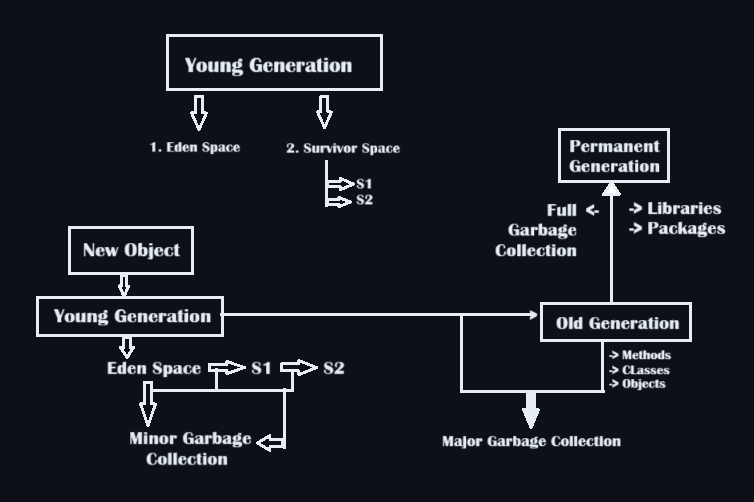
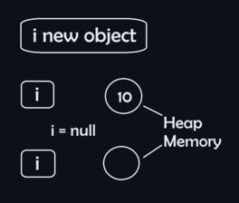

# 15. Garbage Collection

* Proper Method of Memory Management.
* ```mermaid
  graph LR
  A[Memory Heap of Java] --> B[1. Young Generation];
  A --> C[2. Old/Tenured Generation];
  A --> D[3. Permanent Generation];
  ```
* When a new object is first created, it's locked in "Young Generation"
* 
* **Making Objects Eligible for Garbage Collection :**

  1. Nullyfying/Unreachable Objects
     + The objects with lost reference.
     + ```ruby
       Integer i = new Integer(10);
       Integer object;
       i = null;
       ```
     + 
  2. Re-assigning of reference.
     + ```ruby
       class class1{
           public static void main(String[] args){
               class1 obj1 = new class1();
               class1 obj2 = new class1();
               obj2 = obj1; 
           }
       }
       ```
  3. An object created inside a method.
* Finalization:

  - Just before destroying an object, the Garbage collector calls finalize() method on the object to perform clean up.
  - Once finalize() method completes, the object gets destroyed.
  - Syntax: ``protected void finalize() throws throwable``
* **Example 1:**

  ```ruby
  class Employee
  {
      private int ID;
      private int age;
      private String name;
      private static int nextId = 1;

      public Employee(String name, int age) {
          this.name = name;
          this.age = age;
          this.ID = nextId++;
      }

      public void show() {
          System.out.println("ID = " + ID + ", Name = " + name + ", Age = " + age);
      }

      public void showNextId() {
          System.out.println("Next Employee Id will be = " + nextId);
      }
  }

  class garbage
  {
      public static void main(String[] args)
      {
          Employee E = new Employee("ABC", 56);
          E.show();
          E.showNextId();
          Employee F = new Employee("DEF", 45);
          F.show();
          F.showNextId();
          Employee G = new Employee("GHI", 25);
          G.show();
          G.showNextId();

          {   //It is a subblock to keep all those interns.
              Employee X = new Employee("JKL", 23);
              X.show();
              X.showNextId();
              Employee Y = new Employee("MNO", 21);
              Y.show();
              Y.showNextId();
          }

          E.showNextId();
      }
  }

  /*ID = 1, Name = ABC, Age = 56
  Next Employee Id will be = 2
  ID = 2, Name = DEF, Age = 45
  Next Employee Id will be = 3
  ID = 3, Name = GHI, Age = 25
  Next Employee Id will be = 4
  ID = 4, Name = JKL, Age = 23
  Next Employee Id will be = 5
  ID = 5, Name = MNO, Age = 21
  Next Employee Id will be = 6
  Next Employee Id will be = 6*/
  ```
* **Example 2: Modified code for Garbage Collection**

  ```ruby
  class Employees2
  {
      private int ID;
      private int age;
      private String name;
      private static int nextId = 1;

      public Employees2(String name,int age) {
          this.name = name;
          this.age = age;
          this.ID = nextId++;
      }

      public void show(){
          System.out.println("ID = " + ID + ", Name = " + name + ", Age = " + age);
      }

      public void showNextId() {
          System.out.println("Next Employee ID will be = " + nextId);
      }

      protected void finalize() {
          --nextId; //In this case gc will call finalize()
      }             //for 2 times for 2objects
  }

  class GarbageModified
  {
      public static void main(String[] args)
      {
          Employees2 E = new Employees2("ABC",56);
          E.show();
          E.showNextId();
          Employees2 F = new Employees2("DEF",45);
          F.show();
          F.showNextId();
          Employees2 G = new Employees2("GHI",25);
          G.show();
          G.showNextId();

          {
              Employees2 X = new Employees2("JKL",23);
              X.show();
              X.showNextId();
              Employees2 Y = new Employees2("MNO",21);
              Y.show();
              Y.showNextId();
              X = Y = null;
              System.gc();
              System.runFinalization();
          }

          E.showNextId(); 
      }
  }

  /*  ID = 1, Name = ABC, Age = 56
      Next Employee ID will be = 2
      ID = 2, Name = DEF, Age = 45
      Next Employee ID will be = 3
      ID = 3, Name = GHI, Age = 25
      Next Employee ID will be = 4
      ID = 4, Name = JKL, Age = 23
      Next Employee ID will be = 5
      ID = 5, Name = MNO, Age = 21
      Next Employee ID will be = 6
      Next Employee ID will be = 4*/
  ```

References: https://www.geeksforgeeks.org/garbage-collection-java/ ; https://www.geeksforgeeks.org/java-lang-runtime-class-in-java/
